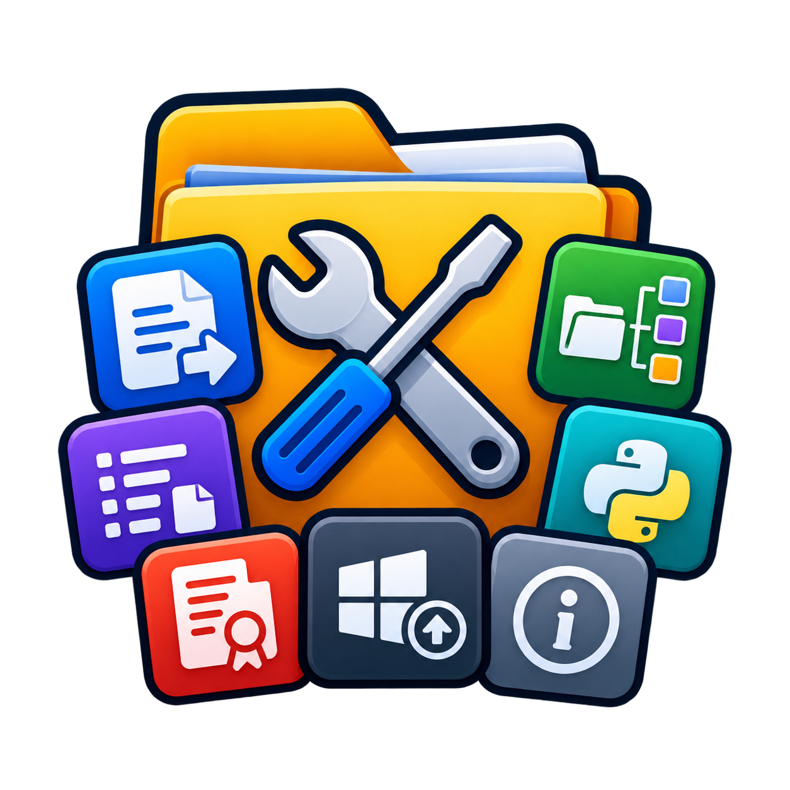

# Utilidades de archivos



App de escritorio para Windows (PyQt6) que junta en una sola ventana varias utilidades que antes eran scripts sueltos, más un actualizador de programas con winget.

**Versión 1.1.0** · Creada por **DoMiNaTh0R** (Kevin González) · © 2026 · Licencia [GNU GPL v3](LICENSE)

## Pestañas

| Pestaña | Qué hace | Script original |
|---|---|---|
| **Copiar** | Robocopy con carpetas (`/XD`) y archivos (`/XF`) a omitir, reintentos, simulación (`/L`) y salida en vivo. Copia la carpeta completa (como Ctrl+C / Ctrl+V) o solo su contenido. Muestra %, velocidad y tiempo restante. Multihilo (`/MT`) automático según el disco: USB 4 hilos, HDD 8, SSD según tu CPU. Sesiones con nombre. | `copiar.bat` |
| **Organizar** | Escanea una carpeta (recursivo), cuenta archivos por extensión y mueve o copia las marcadas a `<destino>/<extensión>/`. Nunca sobrescribe (añade `_1`, `_2`…). | `Filtrador_y_movedor_de_archivos V2.py` |
| **Listar rutas** | `.txt` con las rutas de archivos y/o carpetas (recursivo). Filtro *Todo / Solo estas / Excluir estas* extensiones y carpetas a ignorar. Sesiones con nombre. | `Sacar rutas de subcarpetas.py` |
| **Info entorno** | Versión de Python y de cada paquete de un venv o del Python global; guarda un único `requirements.txt` (pip freeze). | `info_entorno.py` |
| **Licencias** | `THIRD_PARTY_NOTICES.txt` con la licencia completa de cada paquete de un venv o del Python global. Admite el JSON extra (ver abajo). Sesiones con nombre. | `generar_licencias.py` |
| **Actualizaciones** | Actualiza tus programas con winget: revisa que todo sea oficial, verifica SHA256 y firma digital (con PowerShell), actualiza uno por uno y hace un reporte. Ver abajo. | nuevo |
| **Acerca de** | Versión, creador, licencia, cómo se está ejecutando (código fuente, PyInstaller o Nuitka), dónde se guardan la configuración y los registros, y botones para abrirlos. | — |

Todo el trabajo pesado corre en segundo plano: la ventana no se congela al copiar, escanear, generar documentos ni actualizar programas.

## Actualizaciones (winget)

1. **Buscar actualizaciones** ejecuta:
   - una revisión de seguridad (abajo);
   - `winget source update` (opcional, activado por defecto) para usar el catálogo más reciente;
   - `winget upgrade --include-unknown --include-pinned` y `winget pin list`.
2. La tabla muestra nombre, Id, versión instalada y disponible, **salto de versión** (Mayor / Menor / Parche / Compilación), origen, verificación y estado. Se puede buscar, ordenar (A→Z, Z→A, mayor o menor salto, Id, origen, estado; también con clic en la cabecera) y marcar *Todas / Recomendadas / Ninguna / Invertir*.
3. Los paquetes **con versión desconocida** o **anclados** (`winget pin`) salen marcados con ⚠ y sin seleccionar; los puedes marcar a mano.
4. Debajo se ven los **comandos exactos** que se van a ejecutar, en orden (*Copiar comandos* los copia para pegarlos en PowerShell), el registro y el estado de seguridad. La pestaña se desplaza hacia abajo; los botones de acción y el progreso quedan fijos al pie.
5. **Actualizar seleccionadas** los instala **uno por uno** y muestra la salida de winget en el registro. Al terminar vuelve a analizar y abre el **reporte**: cifras (actualizados, con fallo, omitidos…) y una tabla con la versión antes → después y el resultado de cada programa (✓ actualizado, ⟳ reinicio pendiente, ⚠ winget dijo que sí pero la versión no cambió, ✗ falló y por qué, ↷ omitido). **Reintentar** vuelve a intentar los que fallaron (por ejemplo, después de cerrar el programa que estaba abierto). El reporte también se guarda como texto en `registros\`.
6. *Volver a analizar* muestra lo que quedó pendiente.

Si un instalador pide la carpeta de instalación (le pasa a Battle.net: error `0x8A15005F`), la app la lee con `winget list --id … --details` y reintenta una vez con `--location` apuntando a donde ya está instalado.

### Seguridad

winget se ejecuta directamente, igual que si lo escribieras en PowerShell. PowerShell se usa solo para revisar firmas digitales (`Get-AppxPackage`, `Get-AuthenticodeSignature`, `Get-FileHash`), con comandos cortos y legibles: nada de `-EncodedCommand` ni `-ExecutionPolicy Bypass`, que antivirus como Avast bloquean por parecerse a lo que usa el malware.

- **winget original:** App Installer firmado por Microsoft (`Get-AppxPackage` + `Get-AuthenticodeSignature` sobre `winget.exe`). Si no se puede confirmar, no se actualiza nada.
- **Origen oficial:** el origen `winget` tiene que apuntar exactamente a `https://cdn.winget.microsoft.com/cache` con el identificador y tipo de Microsoft.
- **SHA256 obligatorio:** se comprueba que la opción de administrador `InstallerHashOverride` esté desactivada. Así winget calcula el SHA256 de cada instalador y lo rechaza si no coincide con el manifiesto. La app nunca usa `--ignore-security-hash`.
- **Verificar** (antes de instalar, activado por defecto): `winget show` del paquete y versión exactos → SHA256 del manifiesto, sitio de descarga y editor.
- **Comprobar la firma digital** (opcional, más lento): descarga el instalador aparte con `winget download`, revisa quién lo firmó (`Get-AuthenticodeSignature`) y vuelve a calcular el SHA256 con PowerShell. La descarga se borra al terminar. Opción para no instalar los que no tengan firma.
- **Revisión manual:** lo de la Microsoft Store, de orígenes de terceros o con el Id recortado va a otra pestaña y **nunca** se actualiza junto con los demás; cada uno se actualiza por separado y pide confirmación.
- Cada comando lleva `--id … --exact --source … --version …`: se instala exactamente la versión que se revisó.

### Opciones

Están en el botón **⚙ Opciones** (arriba a la derecha), para no llenar la pestaña: modo de instalación (silencioso, con progreso o interactivo), verificar antes, revisar la firma digital, tiempo máximo por paquete, detener todo si uno falla, volver a analizar al terminar, guardar el reporte, mostrar u ocultar desconocidas / ancladas / ignoradas, y la lista de **paquetes ignorados** (también: clic derecho en un paquete → *Ignorar*). Debajo de *Comandos* se resume cómo se van a ejecutar. Durante la actualización: *Detener tras el actual* (seguro) o *Cancelar ya* (corta también la instalación en curso).

**¿Qué es «anclado» (`winget pin`)?** Es una marca que se le pone a un programa desde PowerShell (`winget pin add --id <Id>`) para que `winget upgrade --all` no lo toque y se quede en su versión. La app los muestra marcados con ‖ y sin seleccionar. Los *paquetes ignorados* de la app hacen algo parecido, pero solo dentro de la app.

Algunos instaladores necesitan permisos de administrador: Windows mostrará su aviso (UAC) y hay que aceptarlo.

## Usar desde el código

```bat
build_env.bat
build_env\Scripts\pythonw.exe utilidades_archivos.py
```

`build_env.bat` crea el entorno virtual `build_env` (Python 3.13 si lo tienes, si no el más nuevo) e instala PyQt6 y Pillow; te pregunta si quieres PyInstaller, Nuitka, ambos o ninguno. Si ya existe, lo actualiza.
Con `pythonw` se abre sin ventana de consola.

## Compilar

Doble clic en **`compilar.bat`** y elige una opción:

| Opción | Resultado |
|---|---|
| 1. PyInstaller, carpeta (recomendado) | `dist\pyinstaller\UtilidadesArchivos\UtilidadesArchivos.exe` (~75 MB, abre rápido) |
| 2. PyInstaller, un solo .exe | `dist\pyinstaller\UtilidadesArchivos.exe` |
| 3. Nuitka, carpeta | `dist\nuitka\UtilidadesArchivos\UtilidadesArchivos.exe` (código C nativo, tarda varios minutos) |
| 4. Nuitka, un solo .exe | `dist\nuitka\UtilidadesArchivos.exe` |
| 5. Ambos | PyInstaller y Nuitka, en carpeta |

También desde la terminal, con más opciones:

```bat
build_env\Scripts\python.exe compilar.py pyinstaller [--onefile] [--consola] [--sin-prueba]
build_env\Scripts\python.exe compilar.py nuitka      [--onefile] [--consola] [--sin-prueba]
build_env\Scripts\python.exe compilar.py todo
```

- `--consola`: compila con ventana de consola, para ver errores.
- Junto al `.exe` (y dentro de él) van `LICENSE`, `LICENCIA_LOGO_Y_AVATAR.txt` y `THIRD_PARTY_NOTICES.txt`, que `compilar.py` genera con el mismo formato que la pestaña *Licencias*: la licencia completa de cada paquete de `build_env` (PyQt6, Qt, PyInstaller…).
- Al terminar, `compilar.py` ejecuta el `.exe` con **`--autoprueba`**: sin mostrar la ventana y con una configuración temporal, prueba los recursos, los complementos de Qt y cada pestaña con archivos de prueba (incluido el JSON extra de Licencias y un análisis de winget de solo lectura), y mide cuánto se traba la interfaz. Imprime `OK`/`FALLO` por prueba.
- Nuitka necesita un compilador de C: usa Visual Studio Build Tools si lo tienes; si no, lo descarga solo la primera vez.
- La versión, el nombre, el autor y la licencia del `.exe` (clic derecho → Propiedades → Detalles) salen de las constantes `APP_*` al inicio de `utilidades_archivos.py`. Para una versión nueva basta con cambiar `APP_VERSION` ahí.

La autoprueba también se puede correr a mano: `UtilidadesArchivos.exe --autoprueba` deja `autoprueba.json` junto al `.exe` (tu configuración no se toca).

## Dónde se guardan los datos

| Archivo | Qué es |
|---|---|
| `utilidades_config.json` | Tema, sesiones guardadas, opciones de Actualizaciones, paquetes ignorados, último venv, pestaña y tamaño de la ventana. Se actualiza solo. |
| `registros\` | Registros completos de robocopy (si activas la opción en Copiar) y reportes de Actualizaciones. |
| `fallo_grave.log` | Si la app falla o se cierra sola, aquí queda el motivo (errores de Python, mensajes graves de Qt, pila de Python). Se reescribe en cada arranque. |

Todo va en **`%LOCALAPPDATA%\UtilidadesArchivos`**, igual si abres el `.exe` o `utilidades_archivos.py`. Así la carpeta del programa queda limpia y se puede poner donde sea (hasta en *Archivos de programa*). La pestaña *Acerca de* muestra las rutas y tiene los botones **Abrir registros** y **Abrir carpeta de datos**.

Si tenías una versión anterior que guardaba todo junto al `.exe`, la primera vez se copian la configuración y los registros a la carpeta nueva (los originales no se borran).

## JSON extra de Licencias

Opcional (pestaña Licencias → *Mostrar opciones avanzadas*). Las rutas de `archivo` son relativas a la carpeta del JSON.

```json
{
  "encabezado": "Texto propio que va debajo del título del documento.",
  "componentes": [
    {
      "nombre": "FFmpeg",
      "version": "7.0",
      "tipo": "GNU GPL v3",
      "url": "https://ffmpeg.org",
      "nota": "Se ejecuta como proceso externo.",
      "archivo": "tools/ffmpeg/LICENSE"
    }
  ],
  "faltantes": {
    "paquete-sin-licencia": { "tipo": "MIT", "texto": "…" }
  }
}
```

- `componentes`: cosas que no son paquetes de Python (programas externos, modelos…). Usa `archivo` o `texto`.
- `faltantes`: licencia para paquetes que no traen la suya dentro del wheel.

## Logo e imágenes

Están en `recursos\`. Para cambiar el logo, reemplaza `recursos\logo_app.png` (cuadrado, de preferencia 512 px o más, con fondo transparente) y vuelve a compilar: `compilar.py` regenera `app.ico` solo. El avatar del creador es `recursos\avatar_DoMiN.jpg`.

Si publicas una versión modificada (fork), **tienes que** cambiar el logo y el avatar por los tuyos: no están bajo la GPL (ver [Licencia](#licencia)). Sin la carpeta `recursos\` la app funciona igual (no muestra imágenes) y `compilar.py` compila sin icono propio.

## Estructura

```
utilidades_archivos.py         ← la app (un solo archivo)
recursos/                      ← logo_app.png, app.ico, avatar_DoMiN.jpg (van dentro del .exe)
                                  y LICENCIA_LOGO_Y_AVATAR.txt (no están bajo la GPL)
compilar.py / compilar.bat     ← compilación con PyInstaller o Nuitka + autoprueba
build_env.bat                  ← crea el entorno virtual build_env\ con todo lo necesario
requirements.txt               ← solo para ejecutar (PyQt6); build_env.bat instala también lo de compilar
README.md / LICENSE            ← este archivo y la GNU GPL v3
```

## Licencia

Copyright © 2026 Kevin González (DoMiNaTh0R).

Este programa es software libre: puedes redistribuirlo y/o modificarlo bajo los términos de la **Licencia Pública General de GNU**, versión 3 o (a tu elección) cualquier versión posterior. Se distribuye con la esperanza de que sea útil, pero **sin ninguna garantía**. El texto completo está en [LICENSE](LICENSE).

**Excepción: el logo y el avatar.** `logo_app.png`, `app.ico` y `avatar_DoMiN.jpg` (carpeta `recursos`) **no están bajo la GPL**: © 2026 Kevin González (DoMiNaTh0R), todos los derechos reservados. Se pueden redistribuir sin modificar solo como parte de copias de este programa; cualquier otro uso, modificarlos o usarlos en versiones modificadas requiere permiso por escrito. Detalles en [LICENCIA_LOGO_Y_AVATAR.txt](recursos/LICENCIA_LOGO_Y_AVATAR.txt).

Usa [PyQt6](https://www.riverbankcomputing.com/software/pyqt/) (GPL v3) y [Qt](https://www.qt.io/) (LGPL v3). Robocopy, PowerShell y winget son programas de Windows que la app solo ejecuta; no van incluidos.

## Notas

- **Rutas largas:** Windows no carga DLLs con rutas de más de 260 caracteres. Si la app está en una carpeta muy profunda, usa la ruta corta (8.3) de sus complementos de Qt para no fallar con *"no Qt platform plugin could be initialized"*.
- **Antivirus:** un `.exe` sin firma digital puede tardar en abrir la primera vez (el antivirus lo analiza) o incluso ser bloqueado.
